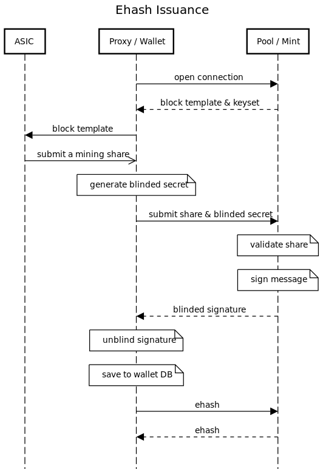

# eHash - blinded Diffie-Hellman key echange for "almost blocks"

Presented by AVERAGE_GARY

(built on the shoulders of SRI team, CDK team, with VNPRC doing basically all of the code)

<!-- end_slide -->

# What is BDHKE?

- Mint Bob publishes public key `K = kG`
- Alice picks **secret** `x` and computes `Y = hash_to_curve(x)`
- Alice sends to Bob: `B_ = Y + rG` with `r` being a random blinding factor (**blinding**)
- Bob sends back to Alice blinded key: `C_ = kB_` (these two steps are the DH key exchange) (**signing**)
- Alice can calculate the unblinded key as `C_ - rK = kY + krG - krG = kY = C` (**unblinding**)
- Alice can take the pair `(x, C)` as a token and can send it to Carol.
- Carol can send `(x, C)` to Bob who then checks that `k*hash_to_curve(x) == C` (**validation**), and if so treats it as a valid spend of a token, adding `x` to the list of spent secrets.

Bob cannot know the origin of `(x, C)` but knows it is valid

<!-- end_slide -->

# What is an "almost block"?
Demonstration to a mining pool that you're hashing.

- Mining share.
- Weak block.
- Proof of Work.

Used for hashrate accounting using [Poisson distribution](https://en.wikipedia.org/wiki/Poisson_distribution)

p.s. hashrate measurement is a guess

<!-- end_slide -->

# Why eHash?

- Privacy
- Smaller Economic Scale
- Permissionless and accountless hashrate marketplaces
- eHash is just data (bearer instrument)
- Because no one can stop you

<!-- column_layout: [1, 1] -->
<!-- column: 0 -->
https://hashpool.dev

<!-- column: 1 -->
https://github.com/fedimint/fedimint/discussions/1504

<!-- end_slide -->

# How eHash?

🍴 Fork [Stratum v2 Reference Implementation](https://github.com/stratum-mining/stratum)

🍴 Fork [Cashu Dev Kit](https://github.com/cashubtc/cdk)

🎱 Create [HashPool](https://github.com/vnprc/hashpool)
<!-- column_layout: [1,1]-->
<!-- column: 0 -->

<!-- column: 1 -->
** Sprinkle in Redis to loosely couple some of the services for now 😅

<!-- end_slide -->

# v1

<!-- column_layout: [1, 1]-->
<!-- column: 0 -->

<!-- column: 1 -->

<!-- end_slide -->

# v1

<!-- column_layout: [1, 1]-->
<!-- column: 0 -->

<!-- column: 1 -->

<!-- end_slide -->

# v2

<!-- column_layout: [1, 1]-->
<!-- column: 0 -->

<!-- column: 1 -->

<!-- end_slide -->

# Spellbook Review

Let's review code!

p.s. mining devs are referred to as goblins

<!-- end_slide -->

# TODO

<!-- column_layout: [1, 1]-->
<!-- column: 0 -->
- refactor
- refactor
- refactor
- upstream code
- launch mainnet
- enable HASH on multiple Cashu wallets
<!-- column: 1 -->

<!-- end_slide -->

# Thank you Hashpool team!

Resources:
- https://github.com/vnprc/hashpool
- https://github.com/vnprc/cdk
- https://hashpool.dev
- https://cashubtc.github.io/nuts/
- https://github.com/stratum-mining/stratum

AVERAGE_GARY 
- https://primal.net/gary
- https://github.com/average-gary
- https://shenandoahbitcoin.club
- https://bitcoinveterans.org
- https://dcbitdevs.com
- https://virginiafreedom.tech
