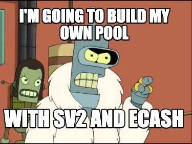
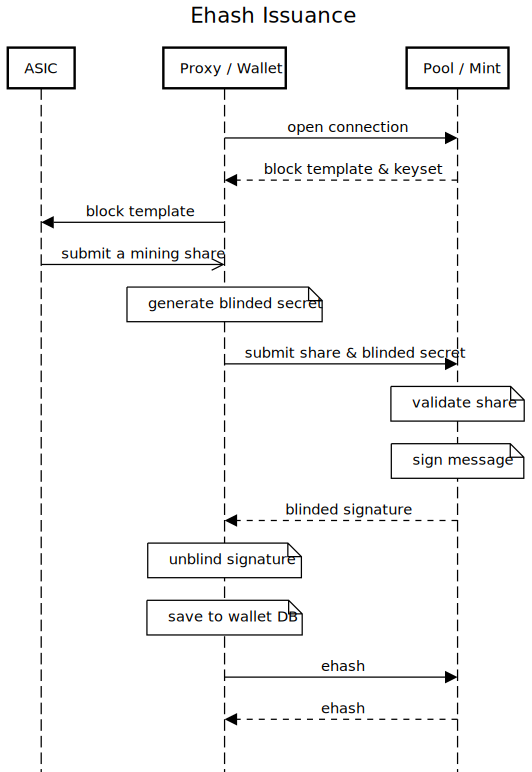
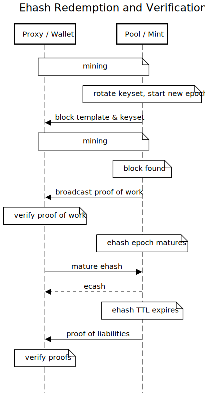
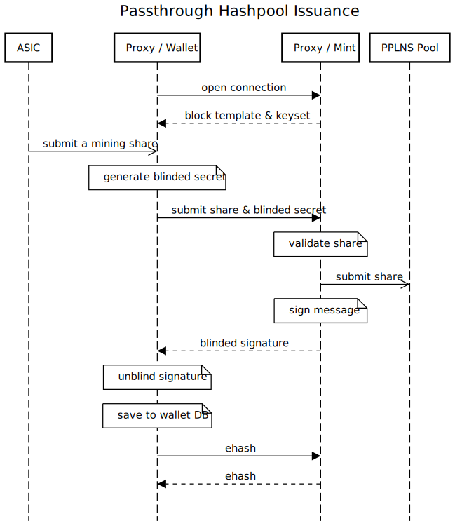
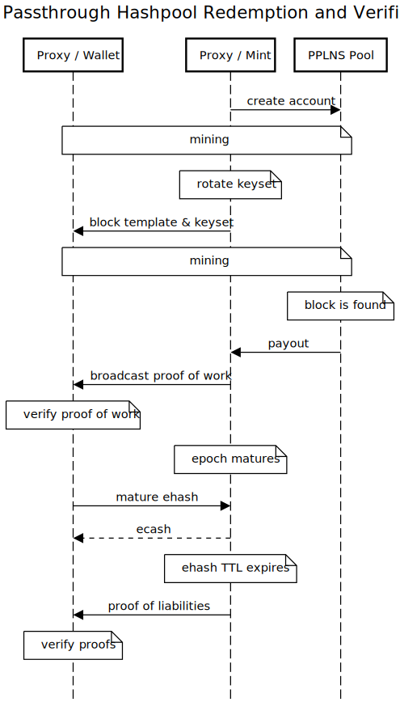
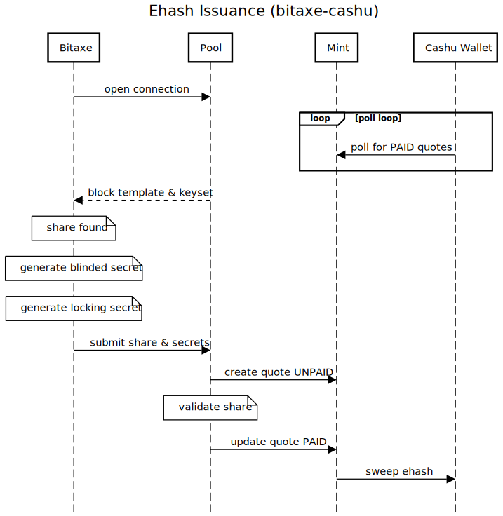
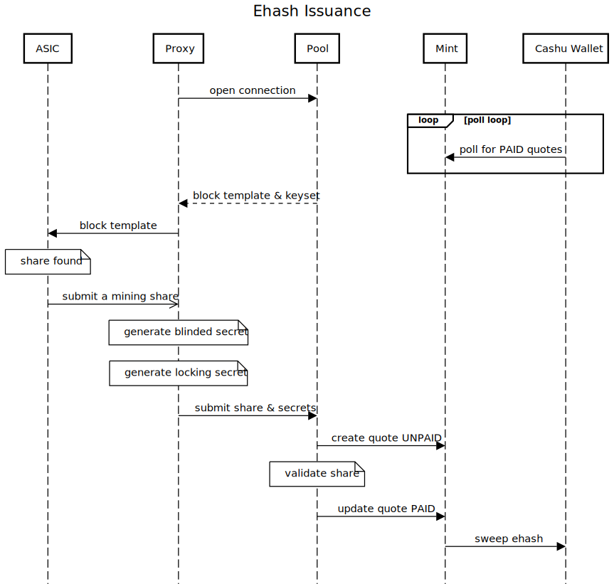

# eHash - blinded Diffie-Hellman key echange for "almost blocks"

Presented by AVERAGE_GARY

------

# What is BDHKE?

Mint Bob publishes public key `K = kG`
Alice picks **secret** `x` and computes `Y = hash_to_curve(x)`
Alice sends to Bob: `B_ = Y + rG` with `r` being a random blinding factor (**blinding**)
Bob sends back to Alice blinded key: `C_ = kB_` (these two steps are the DH key exchange) (**signing**)
Alice can calculate the unblinded key as `C_ - rK = kY + krG - krG = kY = C` (**unblinding**)
Alice can take the pair `(x, C)` as a token and can send it to Carol.
Carol can send `(x, C)` to Bob who then checks that `k*hash_to_curve(x) == C` (**verification**), and if so treats it as a valid spend of a token, adding x to the list of spent secrets.

-----

# What is an "almost block"?

Demonstration to a mining pool that you're hashing.

Mining share.
Weak block.
Proof of Work.

Used for hashrate accounting using [Poisson distribution](https://en.wikipedia.org/wiki/Poisson_distribution)
p.s. hashrate measurement is a guess

-----

# Why eHash?

Privacy
Smaller Economic Scale
Permissionless and accountless marketplaces
Because no one can stop you

https://hashpool.dev
https://github.com/fedimint/fedimint/discussions/1504

------

## How eHash?

### Fork [Stratum v2 Reference Implementation](https://github.com/stratum-mining/stratum)
### Fork [Cashu Dev Kit](https://github.com/cashubtc/cdk)
### Create [HashPool](https://github.com/vnprc/hashpool)

** Sprinkle in Redis to abstract some data availability not ready for demo 😅

------

## v1

------

## v1

------

## v2

------

# JUST SHOW THEM THE CODE

fine.

------

future dev?

------

# Thank you

Content:
https://github.com/vnprc/hashpool
https://hashpool.dev
https://github.com/fedimint/fedimint/discussions/1504
https://cashubtc.github.io/nuts/

Presenter:
Gary K aka AVERAGE_GARY (and others...)
https://shenandoahbitcoin.club
https://bitcoinveterans.org
https://dcbitdevs.com
https://virginiafreedom.tech
